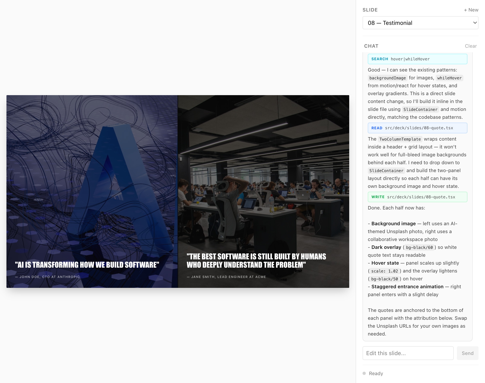
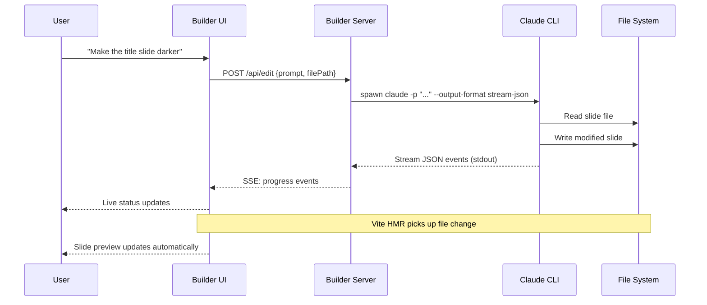

# pls-fix

Talk to your slides. An AI-native presentation system where you describe what you want and get pixel-perfect results.

[](https://creativecommons.org/licenses/by-nc-sa/4.0/)
[](https://deploy.workers.cloudflare.com/?url=https://github.com/theclaymethod/pls-fix)

> [!WARNING]
> **Experimental software.** pls-fix is under active development and requires [Claude Code](https://docs.anthropic.com/en/docs/claude-code) and comfort with React/TypeScript. Expect breaking changes and workflows that assume technical users.



---

## The Builder

The builder is a visual AI workspace for creating and editing slides. Open it in your browser, describe what you want in the chat panel, and watch slides update in real time.

**How it works:** You type a natural language instruction. The builder spawns a Claude Code subprocess that reads your slide file, rewrites it, and saves. Vite HMR picks up the file change and the preview updates live — no reload, no waiting.

```
"Make the title slide darker with white text"
"Add a testimonial from Jane Doe after slide 5"
"Change 250% to 500% on the metrics slide"
"Replace the placeholder image with a San Francisco map"
```

The builder also supports **visual selection** — grab any element on the slide preview to give Claude precise context about what you want changed, then describe the edit.

Beyond single-slide editing, the builder provides:
- **Deck management** — reorder, add, remove slides from a grid overview
- **Design system editor** — preview and regenerate all 63 design primitives
- **Asset browser** — upload and manage images used across slides
- **Session memory** — Claude remembers context within an editing session

### Architecture

The builder runs as a **separate Vite SPA** (`apps/builder/`) that never ships to production. Your deployed deck contains zero builder code — just clean, static slides.

```
You ──→ Builder UI ──→ Builder Server ──→ Claude CLI ──→ File System
                                                              │
                                                     Vite HMR picks up
                                                     file changes in both
                                                     deck and builder
```

---

## Quick Start

```bash
git clone https://github.com/theclaymethod/pls-fix.git
cd pls-fix
pnpm install
pnpm dev
```

`pnpm dev` starts three processes and prints:

```
  pls-fix

  ➜  Deck:    http://localhost:53787/
  ➜  Builder: http://localhost:53788/
```

Ports are dynamic (assigned at startup). Open the **Deck** URL to view your presentation, or the **Builder** URL to start editing.

To use Claude Code skills directly from the CLI:

```bash
claude
/add-slide
```

---

## Claude Code Skills

Six slash commands for slide management, usable from the Claude Code CLI:

| Command | What it does |
|---------|-------------|
| `/add-slide` | Create a new slide from a template |
| `/edit-slide` | Modify an existing slide's content |
| `/remove-slide` | Delete a slide and renumber the rest |
| `/reorder-slide` | Move a slide to a new position |
| `/rename-slide` | Rename slide file, export, and metadata |
| `/create-design-system` | Generate a complete design system from scratch |

Or skip commands entirely — just describe what you want in natural language:

```
"Add a quote slide at position 5 with a testimonial from Jane Doe"
```

---

## Design System

63 components across 8 categories, all driven by CSS custom properties. Every color, font, and spacing value flows from `src/deck/theme.css`.

| Category | Count | Examples |
|----------|-------|---------|
| Typography | 13 | HeroTitle, SectionHeader, Eyebrow, BodyText, Quote |
| Layout | 7 | SlideContainer, TwoColumnLayout, GridSection, Divider |
| Cards | 5 | FeatureCard, StatCard, QuoteCard, InfoCard, ProcessCard |
| Decorative | 9 | IndustrialIcon, IconRow, LogoMark, RuleGrid |
| Interactions | 12 | HoverCard, AnimatedEntry, StaggerContainer, Tabs |
| Data Viz | 6 | ProgressRing, AnimatedCounter, Sparkline, HarveyBall |
| Animations | 11 | fadeIn, slideUp, scaleIn, hoverLift, pathDraw variants |
| Showcase | 1 | Brand bible component for designer preview |

Three color modes per slide: `white`, `dark`, `yellow` — set via the `mode` prop on any template.

### Regenerating the Design System

Use `/create-design-system` or the wizard in the builder. Provide color direction, typography feel, and look & feel — Claude regenerates all design system files while preserving component interfaces.

Preview the result at `/builder/designer`.

### Manual Theming

Edit `src/deck/theme.css`:

```css
:root {
  --color-black: #0A0A0A;
  --color-yellow: #FCD94B;
  --font-heading: 'Bebas Neue', 'Impact', sans-serif;
  --font-body: 'Inter', system-ui, sans-serif;
}
```

---

## Templates

21 slide templates covering common presentation patterns. Each accepts content props and a `mode` for color scheme.

| Template | Use Case |
|----------|----------|
| `TitleTemplate` | Opening slides, section headers |
| `HeroTemplate` | Bold statement with background image |
| `SplitContentTemplate` | Text + image side by side |
| `TwoColumnTemplate` | Two content areas |
| `StatCardsTemplate` | Key metrics (2-4 numbers) |
| `QuoteTemplate` | Testimonials, quotes |
| `BigNumberTemplate` | Single dramatic statistic |
| `FeatureGridTemplate` | Feature list with icons |
| `IconGridTemplate` | Icon-based grid |
| `TimelineTemplate` | Milestones, roadmaps |
| `ComparisonTableTemplate` | Feature matrix |
| `BeforeAfterTemplate` | Before/after comparison |
| `DiagramTemplate` | Custom diagrams |
| `FullscreenImageTemplate` | Full-bleed image |
| `PhotoGridTemplate` | Image gallery |
| `PhoneMockupTemplate` | Mobile app screenshots |
| `BrowserMockupTemplate` | Web app screenshots |
| `TeamTemplate` | Team member profiles |
| `LogoCloudTemplate` | Partner/client logos |
| `StackedCardsTemplate` | Process steps as cards |
| `ThreeUpTemplate` | Three-item showcase |

### Slide File Pattern

```tsx
import { StatCardsTemplate } from "@/templates";

export function Slide05Stats() {
  return (
    <StatCardsTemplate
      mode="dark"
      eyebrow="By the Numbers"
      heading="Impact Metrics"
      stats={[
        { value: "500%", label: "Growth" },
        { value: "2M+", label: "Users" },
        { value: "99.9%", label: "Uptime" },
      ]}
    />
  );
}
```

Register in `src/deck/config.ts` and it appears in the deck.

---

## Architecture

```
pls-fix/
├── src/                            # Shared source (both apps import via @/)
│   ├── deck/                       # YOUR DECK CONTENT
│   │   ├── config.ts               # Slide registry
│   │   ├── theme.css               # CSS custom properties
│   │   └── slides/                 # Individual slide files
│   ├── templates/                  # 21 slide templates
│   ├── design-system/              # 63 UI primitives
│   ├── builder/                    # Builder components + hooks
│   ├── core/                       # Scaling, navigation, auth
│   └── routes/                     # Deck routes (TanStack Start, SSR)
├── apps/
│   └── builder/                    # Builder app (dev-only SPA)
│       ├── vite.config.ts          # Separate Vite config
│       └── routes/                 # Builder routes (TanStack Router)
├── scripts/
│   ├── dev.ts                      # Starts deck + builder + API server
│   └── builder-server.ts           # Claude CLI proxy (HTTP + SSE)
├── .claude/skills/                 # 6 Claude Code slash commands
├── deck.config.ts                  # Auth, dimensions, navigation
└── public/assets/                  # Images, logos, fonts
```

**Two apps, one source.** The deck (TanStack Start, SSR, Cloudflare Workers) and the builder (plain Vite SPA) both import from `src/` via the `@/` path alias. The production build only touches the deck — builder code is completely absent.

### How the Builder AI Chat Works



---

## Configuration

### `deck.config.ts`

```typescript
export const deckConfig = {
  title: "My Presentation",
  auth: { enabled: false, password: "secret" },
  design: { width: 1920, height: 1080 },
  theme: { googleFontsUrl: "https://fonts.googleapis.com/css2?family=..." },
  navigation: { showSlideNumbers: true, enableKeyboard: true },
};
```

### `src/deck/config.ts` — Slide Registry

```typescript
{
  id: "title",           // URL-safe identifier
  fileKey: "01-title",   // Maps to src/deck/slides/01-title.tsx
  title: "Title Slide",  // Full title for sidebar nav
  shortTitle: "Title",   // Abbreviated for compact nav
}
```

---

## Tech Stack

| Category | Technology |
|----------|------------|
| **Core** | React 19, TypeScript 5.9, TanStack Router / Start |
| **Styling** | Tailwind CSS 4, CSS custom properties |
| **Animation** | Motion (Framer Motion), CSS transitions |
| **Builder** | Standalone Vite SPA, dnd-kit, Konva, react-grab |
| **Backend** | Node.js HTTP server, Claude CLI subprocess, SSE streaming |
| **Build** | Vite 7, vite-tsconfig-paths |
| **Deploy** | Cloudflare Workers |

---

## Deployment

### Cloudflare Workers

Click the deploy button at the top, or:

```bash
pnpm build && wrangler deploy
```

### Static Build

`pnpm build` outputs a static site deployable anywhere (Vercel, Netlify, S3, GitHub Pages).

Only the deck is built and deployed. The builder is a dev-only tool.

---

## Keyboard Shortcuts

| Key | Action |
|-----|--------|
| `→` or `Space` | Next slide |
| `←` | Previous slide |
| `Home` | First slide |
| `End` | Last slide |

---

## Prerequisites

| Requirement | Details |
|-------------|---------|
| **Claude Code** | [Install guide](https://docs.anthropic.com/en/docs/claude-code). Requires an Anthropic API key or Claude Pro/Max subscription. |
| **Node.js** | v18+ |
| **pnpm** | `npm install -g pnpm` |

---

## Troubleshooting

**Builder not loading or CSS broken**
The builder runs as a separate Vite instance. If styles are missing, try stopping `pnpm dev` and restarting — this clears the Vite dep cache.

**Skills not found in Claude Code**
Run `claude` from the project root. Skills are discovered from `.claude/skills/`. Try `/refresh` or restart the CLI.

**HMR not updating after AI edit**
The builder server writes files directly to disk. Vite HMR should pick up changes automatically. Check the terminal for errors. A manual page refresh usually resolves it.

**Build errors after design system regeneration**
`/create-design-system` regenerates all design system files. Slides using primitives directly (not through templates) may break. Run `pnpm build` to see errors.

**Claude CLI errors in builder**
The builder server spawns `claude` as a subprocess. Ensure Claude Code is installed and authenticated. Check the terminal for builder server logs.

For other issues, [open a GitHub issue](https://github.com/theclaymethod/pls-fix/issues).

---

## FAQ

**Do I need Claude Code?**
Yes. The builder, skills, and design system generator all depend on it. You can edit slide files manually, but that bypasses the core workflow.

**Can I use it without the builder?**
Yes. Edit `src/deck/slides/` directly, register in `src/deck/config.ts`, and run `pnpm dev:deck` to preview just the deck.

**Why is mobile blocked?**
Slides are a fixed 1920x1080 canvas that scales, not reflows. On small screens everything becomes unreadable.

**How do I add custom fonts?**
Set `theme.googleFontsUrl` in `deck.config.ts`, or add font files to `public/assets/fonts/` with `@font-face` rules in `theme.css`.

---

## License

[Creative Commons Attribution-NonCommercial-ShareAlike 4.0 International](https://creativecommons.org/licenses/by-nc-sa/4.0/)
