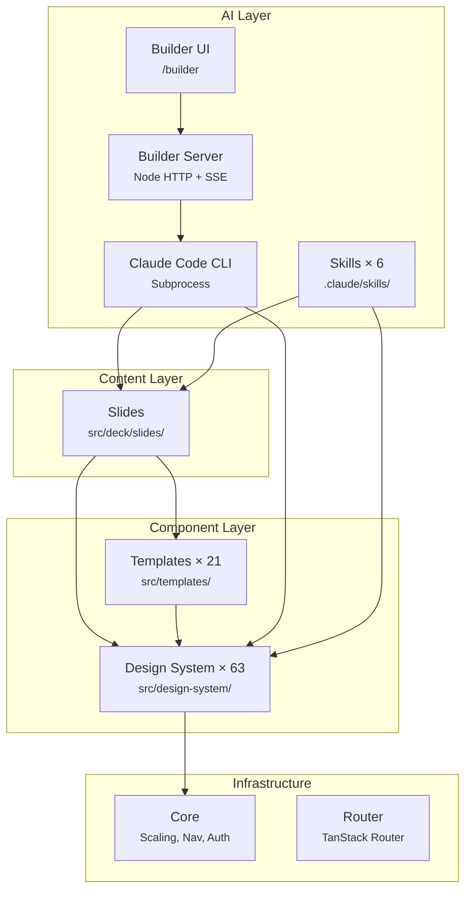
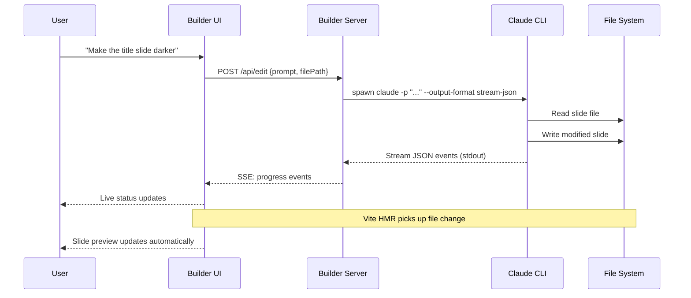

# Vibe Decks

AI-native slide deck system. Describe what you want, get presentation-quality slides.

[](https://creativecommons.org/licenses/by-nc-sa/4.0/)
[](https://deploy.workers.cloudflare.com/?url=https://github.com/theclaymethod/vibe-decks)

> [!WARNING]
> **Experimental software.** Vibe Decks is under active development and is not stable. It requires [Claude Code](https://docs.anthropic.com/en/docs/claude-code) (Anthropic's CLI agent) and comfort with React/TypeScript. Expect breaking changes, rough edges, and workflows that assume technical users. If you're looking for a polished drag-and-drop slide tool, this isn't it.


---

## What is Vibe Decks?

Vibe Decks is a code-first slide deck system where AI builds your presentations. Instead of dragging boxes around in a GUI, you describe what you want in natural language — through a visual builder UI or the Claude Code CLI — and get pixel-perfect 1920x1080 slides built from a design system of 63 components across 21 templates.

- **21 slide templates** covering common presentation patterns (title, stats, timeline, comparison, mockups, team, etc.)
- **63 design system primitives** across 8 categories (typography, layout, cards, decorative, interactions, data-viz, animations, showcase)
- **Visual builder** with AI chat at `/builder` — describe changes, see them live
- **6 Claude Code skills** for slide management (`/add-slide`, `/edit-slide`, `/remove-slide`, `/reorder-slide`, `/rename-slide`, `/create-design-system`)
- **Automatic scaling** — slides are authored at 1920x1080 and scale to fit any viewport
- **One-click deploy** to Cloudflare Workers

---

## Prerequisites

> [!CAUTION]
> **Claude Code is required.** The builder, skills, and AI workflows all depend on Claude Code to function. Without it, you can still manually edit slide files, but you lose the core value proposition.

| Requirement | Details |
|-------------|---------|
| **Claude Code** | [Install guide](https://docs.anthropic.com/en/docs/claude-code). Requires an Anthropic API key or Claude Pro/Max subscription. |
| **Node.js** | v18+ |
| **pnpm** | Package manager (`npm install -g pnpm`) |
| **Technical comfort** | React, TypeScript, reading error messages, basic terminal usage |

This is not production-ready software. The API surface is changing, design system regeneration can break slides, and the builder server spawns Claude CLI subprocesses. Use it for experimentation and personal projects.

---

## Quick Start

```bash
git clone https://github.com/theclaymethod/vibe-decks.git
cd vibe-decks
pnpm install
pnpm dev
```

`pnpm dev` starts two processes:
- **Vite dev server** → `http://localhost:5173` (slide deck)
- **Builder server** → auto-assigned port (proxied through Vite at `/api/*`)

Open `http://localhost:5173` to see the deck. Open `http://localhost:5173/builder` for the visual builder UI.

To use Claude Code skills, open a separate terminal in the project directory:

```bash
claude
```

Then use slash commands like `/add-slide` or `/edit-slide`, or just describe what you want in natural language.

---

## Architecture

### Layer Hierarchy



### How the Builder AI Chat Works



### Layer Descriptions

**Design System** (`src/design-system/`) — 63 primitives organized into 8 modules: typography (13), layout (7), cards (5), decorative (9), interactions (12), data-viz (6), animations (11), and a showcase component. All components use CSS custom properties from `theme.css` for theming. Three color modes: white, dark, yellow.

**Templates** (`src/templates/`) — 21 composed slide layouts built from design system primitives. Each template accepts content props and handles internal layout. Templates are the standard way to build slides.

**Slides** (`src/deck/slides/`) — Your actual slide content. Each file imports a template (or design system primitives directly) and passes content props. Registered in `src/deck/config.ts`.

**Core** (`src/core/`) — Infrastructure: `slide-scaler.tsx` (1920x1080 → viewport scaling), `keyboard-nav.ts` (arrow key navigation), `slide-nav.tsx` (sidebar navigation), `auth-gate.tsx` (password protection), `mobile-blocker.tsx` (desktop-only gate), `deck-layout.tsx` (slide frame).

**Builder** (`src/routes/builder/`) — Visual editing interface. Routes: `/builder` (deck overview + AI chat), `/builder/{fileKey}` (single slide editor), `/builder/designer` (design system preview), `/builder/create-design-system` (design system wizard).

**Builder Server** (`scripts/builder-server.ts`) — Node.js HTTP server that proxies AI requests. Spawns Claude CLI as a subprocess, streams output back via SSE. Endpoints for slide editing, design system creation/editing, asset management, and deck-level chat.

**Skills** (`.claude/skills/`) — 6 slash commands for Claude Code: `add-slide`, `edit-slide`, `remove-slide`, `reorder-slide`, `rename-slide`, `create-design-system`. Each skill is a markdown file with structured instructions that Claude Code follows.

---

## Three Ways to Customize

### 1. Builder AI Chat (recommended)

Open `http://localhost:5173/builder` and use the chat panel. Describe what you want in natural language.

```
"Make the title slide use a dark background with white text"
"Add a new slide after the timeline showing customer logos"
"Change the stat from 250% to 500% on the metrics slide"
```

The builder spawns a Claude Code subprocess, streams progress, and Vite HMR updates the preview live.

### 2. Claude Code Skills

In a terminal with `claude` running:

```
/add-slide         → walks you through creating a new slide
/edit-slide        → modify an existing slide's content
/remove-slide      → delete a slide and renumber
/reorder-slide     → move a slide to a new position
/rename-slide      → rename slide file, export, and metadata
/create-design-system → generate a complete design system from scratch
```

Or skip skills and just describe what you want:

```
"Add a quote slide at position 5 with a testimonial from Jane Doe"
```

### 3. Manual Editing

Edit slide files directly in `src/deck/slides/`. Each slide is a React component:

```tsx
import { StatCardsTemplate } from "@/templates";

export function Slide05Stats() {
  return (
    <StatCardsTemplate
      mode="dark"
      eyebrow="By the Numbers"
      heading="Impact Metrics"
      stats={[
        { value: "500%", label: "Growth" },
        { value: "2M+", label: "Users" },
        { value: "99.9%", label: "Uptime" },
      ]}
    />
  );
}
```

Register it in `src/deck/config.ts` and it appears in the deck.

---

## Design System

The design system is the visual foundation. All 63 components read colors, fonts, spacing, and borders from CSS custom properties in `theme.css`.

### Creating a Custom Design System

Use the `/create-design-system` skill in Claude Code, or the wizard at `/builder/create-design-system`. You'll provide:

1. **Color direction** — named palette or specific hex values
2. **Typography direction** — heading/body font pairing and feel (industrial, editorial, geometric, humanist)
3. **Look & feel** — sharp & technical, soft & friendly, bold & editorial, or minimal & restrained
4. **Inspiration images** — upload references to `public/assets/inspiration/`

Claude regenerates all design system files while preserving component interfaces, then runs build verification and visual checks.

### Previewing the Design System

Navigate to `/builder/designer` to see a showcase of all design system primitives rendered with current theme values.

### Manual Theming

Edit `src/deck/theme.css` to change CSS custom properties:

```css
:root {
  /* Colors */
  --color-black: #0A0A0A;
  --color-white: #FFFFFF;
  --color-yellow: #FCD94B;

  /* Typography */
  --font-heading: 'Bebas Neue', 'Impact', sans-serif;
  --font-body: 'Inter', system-ui, sans-serif;
  --font-mono: 'JetBrains Mono', monospace;

  /* Spacing */
  --slide-padding: 64px;
  --slide-gap: 48px;

  /* Borders & Radius */
  --border-thin: 1px;
  --radius-sm: 2px;
  --radius-md: 4px;
  --radius-lg: 8px;

  /* Shadows */
  --shadow-sm: 0 2px 8px rgba(0, 0, 0, 0.08);
  --shadow-md: 0 4px 12px rgba(0, 0, 0, 0.12);

  /* Animation */
  --duration-fast: 150ms;
  --duration-normal: 300ms;
}
```

### Color Modes

Slides support three color modes via the `data-slide-mode` attribute: `white`, `dark`, and `yellow`. Each mode overrides the relevant CSS custom properties. Set the mode via the `mode` prop on templates:

```tsx
<TitleTemplate mode="dark" heading="..." />
```

### Component Categories

| Category | Module | Count | Examples |
|----------|--------|-------|---------|
| Typography | `typography.tsx` | 13 | HeroTitle, SectionHeader, Eyebrow, BodyText, Quote, ListItem |
| Layout | `layout.tsx` | 7 | SlideContainer, TwoColumnLayout, GridSection, Divider, HeaderBar |
| Cards | `cards.tsx` | 5 | FeatureCard, StatCard, QuoteCard, InfoCard, ProcessCard |
| Decorative | `decorative.tsx` | 9 | IndustrialIcon, IconRow, LogoMark, RuleGrid, CrosshairMark |
| Interactions | `interactions.tsx` | 12 | HoverCard, AnimatedEntry, StaggerContainer, Tabs, Tooltip, QuoteCarousel |
| Data Viz | `data-viz.tsx` | 6 | ProgressRing, AnimatedCounter, Sparkline, HarveyBall, MagnitudeBar |
| Animations | `animations.ts` | 11 | fadeInVariants, slideUpVariants, scaleInVariants, hoverLift, pathDrawVariants |
| Showcase | `showcase.tsx` | — | Brand bible component for designer preview |

---

## Template Reference

All templates accept a `mode` prop (`"white"`, `"dark"`, `"yellow"`) for color scheme control.

| Template | Use Case | Key Props |
|----------|----------|-----------|
| `TitleTemplate` | Opening slides, section headers | `heading`, `subtitle`, `eyebrow` |
| `HeroTemplate` | Bold statement with background image | `heading`, `subtitle`, `backgroundImage` |
| `SplitContentTemplate` | Text + image side by side | `heading`, `body`, `image`, `imagePosition` |
| `TwoColumnTemplate` | Two content areas | `heading`, `left`, `right` |
| `StatCardsTemplate` | Key metrics (2-4 numbers) | `heading`, `stats[]` |
| `QuoteTemplate` | Testimonials, quotes | `quote`, `author`, `role` |
| `BigNumberTemplate` | Single dramatic statistic | `number`, `label`, `context` |
| `FeatureGridTemplate` | Feature list with icons | `heading`, `features[]` |
| `IconGridTemplate` | Icon-based grid | `heading`, `items[]` |
| `TimelineTemplate` | Milestones, roadmaps | `heading`, `events[]` |
| `ComparisonTableTemplate` | Feature matrix | `heading`, `columns[]`, `rows[]` |
| `BeforeAfterTemplate` | Before/after comparison | `heading`, `before`, `after` |
| `DiagramTemplate` | Custom diagrams | `heading`, `children` |
| `FullscreenImageTemplate` | Full-bleed image | `image`, `overlay`, `heading` |
| `PhotoGridTemplate` | Image gallery | `heading`, `photos[]` |
| `PhoneMockupTemplate` | Mobile app screenshots | `heading`, `screenshot`, `description` |
| `BrowserMockupTemplate` | Web app screenshots | `heading`, `screenshot`, `url` |
| `TeamTemplate` | Team member profiles | `heading`, `members[]` |
| `LogoCloudTemplate` | Partner/client logos | `heading`, `logos[]` |
| `StackedCardsTemplate` | Process steps as cards | `heading`, `cards[]` |
| `ThreeUpTemplate` | Three-item showcase | `heading`, `items[]` |

### Slide File Pattern

```tsx
// src/deck/slides/03-intro.tsx
import { SplitContentTemplate } from "@/templates";

export function Slide03Intro() {
  return (
    <SplitContentTemplate
      mode="white"
      eyebrow="About Us"
      heading="We Build Things"
      body="Description text here."
      image="/assets/photo.jpg"
      imagePosition="right"
    />
  );
}
```

---

## Configuration

### `deck.config.ts` — Top-Level Config

```typescript
export const deckConfig = {
  title: "My Presentation",
  subtitle: "A Vibe Decks Template",

  auth: {
    enabled: false,      // Password-protect the deck
    password: "secret",
  },

  design: {
    width: 1920,         // Slide canvas width
    height: 1080,        // Slide canvas height
    minViewportWidth: 375,
  },

  theme: {
    googleFontsUrl: "https://fonts.googleapis.com/css2?family=...",
  },

  navigation: {
    showSlideNumbers: true,
    enableKeyboard: true,
    autoCollapseNav: true,
    autoCollapseDelay: 800,
  },
};
```

### `src/deck/config.ts` — Slide Registry

Central registry mapping slide IDs to lazy-loaded components. Each entry has:

```typescript
{
  id: "title",           // URL-safe identifier (used in routes)
  fileKey: "01-title",   // Maps to src/deck/slides/01-title.tsx
  title: "Title Slide",  // Full title for sidebar nav
  shortTitle: "Title",   // Abbreviated for compact nav
}
```

Slides are lazy-loaded — only the current slide's chunk loads initially.

### `src/deck/theme.css` — Theme Variables

CSS custom properties organized into categories:

| Category | Variables |
|----------|-----------|
| **Colors** | `--color-black`, `--color-white`, `--color-yellow`, `--color-text-*`, `--color-bg-*`, `--color-border-*` |
| **Typography** | `--font-heading`, `--font-body`, `--font-mono` |
| **Spacing** | `--slide-padding`, `--slide-gap` |
| **Borders** | `--border-thin`, `--border-medium`, `--border-thick`, `--border-heavy` |
| **Radius** | `--radius-none`, `--radius-sm`, `--radius-md`, `--radius-lg` |
| **Shadows** | `--shadow-sm`, `--shadow-md`, `--shadow-lg`, `--shadow-xl` |
| **Animation** | `--duration-fast`, `--duration-normal`, `--duration-slow`, `--ease-out`, `--ease-in-out` |

---

## Project Structure

```
vibe-decks/
├── src/
│   ├── deck/                        # YOUR DECK CONTENT
│   │   ├── config.ts                # Slide registry (lazy loaders + metadata)
│   │   ├── theme.css                # CSS custom properties
│   │   └── slides/                  # Individual slide files (01-title.tsx, etc.)
│   ├── templates/                   # 21 slide templates
│   │   ├── index.ts                 # Barrel export
│   │   ├── title.tsx                # TitleTemplate
│   │   ├── hero.tsx                 # HeroTemplate
│   │   ├── split-content.tsx        # SplitContentTemplate
│   │   └── ...                      # 18 more template files
│   ├── design-system/               # 63 UI primitives
│   │   ├── index.ts                 # Barrel export
│   │   ├── typography.tsx           # 13 text components
│   │   ├── layout.tsx               # 7 layout primitives
│   │   ├── cards.tsx                # 5 card components
│   │   ├── decorative.tsx           # 9 decorative elements
│   │   ├── interactions.tsx         # 12 interactive components
│   │   ├── data-viz.tsx             # 6 data visualization components
│   │   ├── animations.ts           # 11 motion variants
│   │   └── showcase.tsx             # Brand bible preview
│   ├── core/                        # Infrastructure
│   │   ├── slide-scaler.tsx         # 1920x1080 → viewport scaling
│   │   ├── keyboard-nav.ts          # Arrow key navigation
│   │   ├── slide-nav.tsx            # Sidebar navigation panel
│   │   ├── deck-layout.tsx          # Slide frame/chrome
│   │   ├── auth-gate.tsx            # Password protection
│   │   └── mobile-blocker.tsx       # Desktop-only gate
│   └── routes/                      # TanStack Router pages
│       ├── deck/$slide.tsx          # Slide viewer
│       ├── builder/index.tsx        # Deck overview + AI chat
│       ├── builder/$fileKey.tsx     # Single slide editor
│       ├── builder/designer.tsx     # Design system preview
│       └── builder/create-design-system.tsx
├── scripts/
│   ├── dev.ts                       # Starts Vite + builder server
│   └── builder-server.ts           # Node HTTP server (Claude CLI proxy)
├── .claude/skills/                  # Claude Code slash commands
│   ├── add-slide/SKILL.md
│   ├── edit-slide/SKILL.md
│   ├── remove-slide/SKILL.md
│   ├── reorder-slide/SKILL.md
│   ├── rename-slide/SKILL.md
│   └── create-design-system/SKILL.md
├── deck.config.ts                   # Auth, dimensions, navigation
├── CLAUDE.md                        # Claude Code project instructions
└── public/assets/                   # Images, logos, inspiration references
```

---

## Tech Stack

| Category | Technology |
|----------|------------|
| **Core** | React 19, TypeScript 5.9, TanStack Router |
| **Styling** | Tailwind CSS 4, CSS custom properties |
| **Animation** | Motion (Framer Motion), CSS transitions |
| **Builder** | React, dnd-kit (drag-and-drop), Konva (canvas) |
| **Backend** | Node.js HTTP server, Claude CLI subprocess, SSE streaming |
| **Build** | Vite 7, vite-tsconfig-paths |
| **Deploy** | Cloudflare Workers, Wrangler |

---

## Keyboard Shortcuts

| Key | Action |
|-----|--------|
| `→` or `Space` | Next slide |
| `←` | Previous slide |
| `Home` | First slide |
| `End` | Last slide |

Navigation can be disabled in `deck.config.ts` via `navigation.enableKeyboard: false`.

---

## Deployment

### Cloudflare Workers (primary)

Click the deploy button at the top of this README, or:

```bash
pnpm build
wrangler deploy
```

### Static Build

The output of `pnpm build` is a static site. Deploy it anywhere that serves static files (Vercel, Netlify, S3, GitHub Pages, etc.).

---

## Troubleshooting

**Builder server not starting**
`pnpm dev` starts both Vite and the builder server. If the builder server fails, check that `tsx` is available (`npx tsx --version`). The builder server runs on an auto-assigned port and is proxied through Vite.

**Skills not found in Claude Code**
Make sure you're running `claude` from the project root directory. Skills are discovered from `.claude/skills/`. If Claude Code doesn't recognize a skill, try `/refresh` or restart the CLI.

**HMR not updating after AI edit**
The builder server writes files directly to disk. Vite's HMR should pick up changes automatically. If it doesn't, check the Vite terminal for errors. A manual page refresh usually resolves it.

**Build errors after design system regeneration**
`/create-design-system` regenerates all design system files. If slides were using design system primitives directly (not through templates), they may reference components that changed. Run `pnpm build` to see errors, then fix affected slides.

**"Mobile devices not supported" message**
By design. Slides are 1920x1080 and don't reflow to small screens. The `mobile-blocker.tsx` component gates access on viewports narrower than `minViewportWidth` (default: 375px).

**Claude CLI errors in builder**
The builder server spawns `claude` as a subprocess. Ensure Claude Code is installed and authenticated. Check the terminal running `pnpm dev` for builder server logs prefixed with timestamps.

For other issues, [open a GitHub issue](https://github.com/theclaymethod/vibe-decks/issues).

---

## FAQ

**Do I need Claude Code?**
Yes. The builder UI, slash command skills, and design system generator all require Claude Code. You can edit slide files manually without it, but that bypasses the primary workflow.

**Is this production-ready?**
No. Interfaces change between commits, design system regeneration can break existing slides, and the builder server runs with `--dangerously-skip-permissions`. Use it for experiments and personal presentations.

**Can I use it without the builder?**
Yes. Edit files in `src/deck/slides/` directly, register them in `src/deck/config.ts`, and run `pnpm dev` to preview. The builder is the recommended workflow but not the only one.

**Why is mobile blocked?**
Slides are designed at a fixed 1920x1080 canvas. Content doesn't reflow — it scales. On very small screens the scaling makes everything unreadable, so the app shows a desktop-only message instead.

**How do I add custom fonts?**
Two options: (1) Set `theme.googleFontsUrl` in `deck.config.ts` to a Google Fonts URL, or (2) add font files (`.woff2`, `.ttf`, etc.) to `public/assets/fonts/` and declare `@font-face` rules in `src/deck/theme.css`. Either way, reference the font families via `--font-heading`, `--font-body`, or `--font-mono` in `theme.css`.

**Can I use my own images?**
Yes. Place them in `public/assets/` and reference them as `/assets/filename.jpg` in your slides. The builder also has an asset upload UI.

---

## License

This work is licensed under [Creative Commons Attribution-NonCommercial-ShareAlike 4.0 International](https://creativecommons.org/licenses/by-nc-sa/4.0/).
